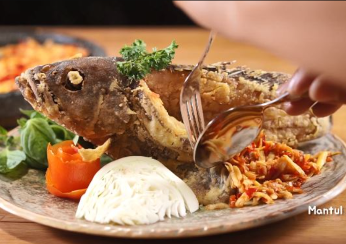

# Resep Rendang daging sapi kering

Rendang adalah masakan yang kaya akan kandungan bumbu rempah. Selain bahan dasar daging, rendang menggunakan santan kelapa (karambia), dan campuran dari berbagai bumbu khas yang dihaluskan di antaranya cabai (lado), serai, lengkuas, kunyit, jahe, bawang putih, bawang merah, dan aneka bumbu lainnya yang biasanya disebut sebagai pemasak. Keunikan rendang adalah penggunaan bumbu-bumbu alami, yang bersifat antiseptik dan membunuh bakteri patogen sehingga bersifat sebagai bahan pengawet alami. Bawang putih, bawang merah, jahe, dan lengkuas diketahui memiliki aktivitas antimikroba yang kuat.Tidak mengherankan jika rendang dapat disimpan seminggu hingga empat minggu.

*Source : [Wikipedia](https://id.wikipedia.org/wiki/Rendang)*

*Source : [briliofood.net](https://www.briliofood.net/resep/11-resep-rendang-daging-sapi-nikmat-empuk-dan-bikin-nagih-220705q.html)*

----------

### Bahan:
----------

- 1 kg daging sapi bagian paha
- 2500 ml santan
- 3 batang serai digeprek
- 8 lembar daun jeruk
- 5 lembar daun salam

### Bumbu halus:
----------------

- 250 gr cabai keriting merah dan rawit
- 250 gr bawang merah
- 8 siung bawang putih
- 1 sdt jintan
- 1 sdt adas
- 1 butir pala
- 5 butir cengkeh
- 3 butir kemiri
- 1 sdt merica
- 4 sdm ketumbar
- Seruas jahe
- Seruas lengkuas
- Seruas kunyit
- Garam dan gula secukupnya

### Cara membuat:
------------------

1. Potong-potong daging kira-kira 1 kg jadi 20 potong.
2. Masukkan santan ke dalam wajan, tambahkan serai, daun jeruk, daun salam dan bumbu halus. Masak di atas api kecil sambil terus diaduk perlahan. Cara mengaduknya seperti orang menimba. Santan diaduk di bagian permukaannya, diambil sedikit demi sedikit dengan sendok sayur. Timba-timba santan hingga mendidih sekitar 15 menit.
3. Masukkan daging, aduk-aduk hingga mendidih, kecilkan api. Beri garam dan gula secukupnya. Masak sampai santan mengental, aduk supaya tidak gosong.
4. Teruskan memasak dengan api kecil sampai rendang mengering dan berminyak.

## Rekomendasi Lainnya 
|                                             |                                                |
| :----------------------------------------:  | :--------------------------------------------: |
|    |  |
| [Ayam Tangkap](https://www.briliofood.net/review/ikan-kerapu-sambal-pencit-220714h.html) | [Ikan Kerapu Sambel Pecit](https://www.briliofood.net/review/ikan-kerapu-sambal-pencit-220714h.html)                       |

 